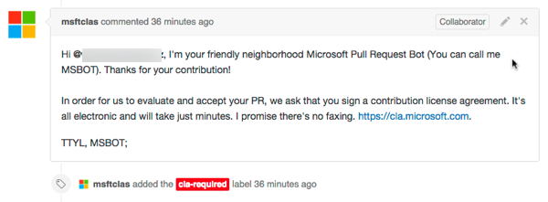
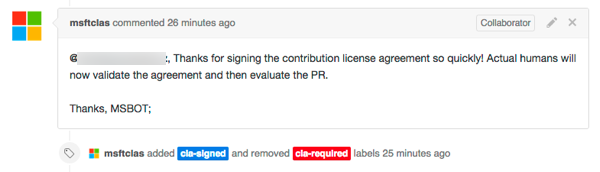

# Contributor License Agreement

You must sign a [Microsoft Contribution License Agreement (CLA)](https://cla.microsoft.com/) before your PR will be merged. This is a one-time requirement for projects in the **OfficeDev** organization. You can read more about [Contribution License Agreements (CLA)](http://en.wikipedia.org/wiki/Contributor_License_Agreement) on wikipedia.

However, you don't have to do this up-front. You can simply clone, fork, and submit your pull-request as usual.

When your pull-request is created, it is classified by a CLA bot. If the change is trivial, i.e. you just fixed a typo, then the PR is labelled with **cla-not-required**. Otherwise it's classified as **cla-required**. In that case, the system will also tell you how you can sign the CLA by leaving a comment in the PR. 

 

Once you have signed a CLA, after a few minutes the CLA bot will add another comment to the PR indicating it received your signed CLA. It will then remove the **cla-required** label.   Your current and all future pull-requests will now be labelled as **cla-signed**:

**PR's with the label `cla-required` will NOT be reviewed or merged under any circumstances**. 

Signing the CLA might sound scary but it's actually super simple and can be done in less than a minute.