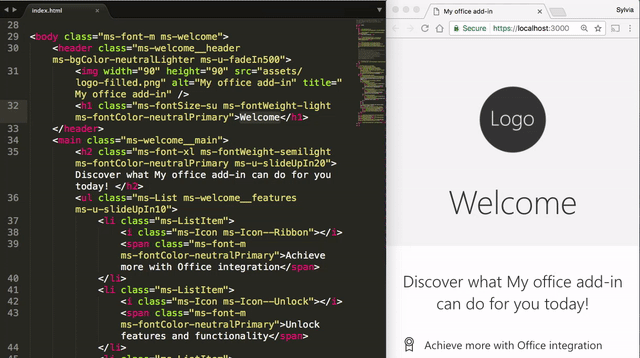
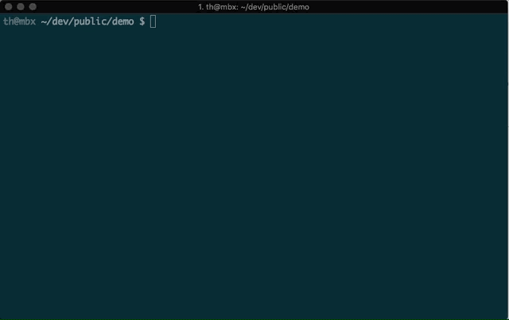

# Yeoman generator for Office Add-ins - YO OFFICE!

[](http://badge.fury.io/js/generator-office)
[](https://npmjs.org/package/generator-office)
[](https://travis-ci.org/OfficeDev/generator-office)

This [Yeoman](http://yeoman.io) generator creates a Node.js [Office Add-in](https://docs.microsoft.com/en-us/office/dev/add-ins) project that can be managed with Visual Studio Code or any other editor. You can use it to create Office Add-ins for:

- Excel
- OneNote
- Outlook
- PowerPoint
- Project
- Word
- Excel Custom Functions

Like other Yeoman generators, this generator simply creates the scaffolding of files for your Office Add-in project. You can choose to create Office Add-in projects using plain HTML, CSS & JavaScript, or using Angular or React, and can choose between JavaScript and Typescript as well.

> **Note:** While you can also use [Visual Studio](https://visualstudio.microsoft.com/vs) to create Office Add-in projects, the Yeoman generator provides more options in terms of the types of projects you can create. For example:
> - The Yeoman generator can create Office Add-in projects that use plain HTML, CSS & JavaScript, or React, or Angular, whereas Visual Studio can only create Office Add-in projects that use plain HTML, CSS & JavaScript.
> - The Yeoman generator can create Office Add-ins projects that use TypeScript, whereas Visual Studio cannot.
> - The Yeoman generator can create add-ins for Excel, OneNote, Outlook, PowerPoint, Project, Word, Excel Custom Functions, whereas Visual Studio can only create add-ins for Excel, Outlook, PowerPoint, and Word.

For detailed information about using the Yeoman generator to create Office Add-ins, see any of the 5-minute quick starts in the [Office Add-ins documentation](https://docs.microsoft.com/en-us/office/dev/add-ins).

## Install

> **Important:** If this is the first time you're using Yeoman or installing a Yeoman generator, first install [Git](https://git-scm.com/download) and [Node.js](https://nodejs.org) (version 8.0.0 or later). For developers on Mac, we recommend using [Node Version Manager](https://github.com/creationix/nvm) to install Node.js with the right permissions. When the installation completes, restart your console (or if you are using Windows, restart your machine) to ensure you use the updated system environment variables.

Install `yo` (Yeoman) and `generator-office` globally using NPM.

```bash
$ npm install -g yo generator-office
```

## Usage

```bash
$ yo office [arguments] [options]
```

### Command Line Arguments
The following command line arguments are supported. If using the command line arguments, you must use them in the order cited below, or the generator will prompt you for the values.

#### `projectType`
Specifies the project type to create. 

Project Type | Description
----------- | ------------------------
taskpane | Task Pane add-in using HTML
angular | Task Pane add-in using the Angular framework
react | Task Pane add-in using the React framework
excel-functions | Task Pane add-in with Excel Custom Functions
manifest | Manifest and related files for an Office Add-in
  - Type: String
  - Optional

#### `name`
Title of the project - this is the display name that is written the manifest.xml file.
  - Type: String
  - Optional
 
>**Note:** The Windows command prompt requires this argument to be in quotes (e.g. "My Office Add-in")

#### `host`
The Microsoft Office client application that can host the add-in. The supported arguments include Excel (`excel`), OneNote (`onenote`), Outlook (`outlook`), PowerPoint (`powerpoint`), Project (`project`), and Word (`word`).
  - Type: String
  - Optional

### Command Line Options
The following command line options are supported. If these are not specified, the generator will prompt you for the values before scaffolding the project.  The options should be specified after the projectType, name and host arguments.

Specifying `--output` tells the generator to create the project in a specific location.  If the output parameter is not specified, the project will be created in the current directory. If the output option specifies a non-empty folder,
the generator will inform you so you don't accidentally overwrite existing files.

  - Type: String
  - Optional

Specifying `--js` tells the generator to use JavaScript.

  - Type: Boolean
  - Default: False
  - Optional

  Specifying `--ts` tells the generator to use TypeScript.

  - Type: Boolean
  - Default: False
  - Optional

    Specifying `--details` tells the generator to provide detailed help, including all the accepted values for each project type and host,

  - Type: Boolean
  - Default: False
  - Optional

#### `--skip-install`

After scaffolding the project, the generator (and all sub generators) run all package management install commands such as `npm install` & `typings install`. Specifying `--skip-install` tells the generator to skip this step.

  - Type: Boolean
  - Default: False
  - Optional

## Running the Generated Site

Launch the local HTTPS site on `https://localhost:3000` by simply typing the following command in your console:

```bash
$ npm start
```

> **Note**: Office Add-ins should use HTTPS, not HTTP, even when you are developing. If you are prompted to install a certificate after you run `npm start`, accept the prompt to install the certificate that the Yeoman generator provides.

Browse to the 'External' IP address listed in your console to test your web app across multiple browsers and devices that are connected on your local network.



## Validate manifest.xml

As you modify your `manifest.xml` file, use the included [Office Toolbox](https://github.com/OfficeDev/office-toolbox) to ensure that your XML file is correct and complete. It will also give you information on against what platforms to test your add-ins before submitting to the store.

To run Office Add-in Validator, use the following command in your project directory:
```bash
$ npm run validate
```


For more information on manifest validation, refer to our [add-in manifests documentation](https://docs.microsoft.com/en-us/office/dev/add-ins/develop/add-in-manifests).

## Contributing

### [Contributing Guidelines](CONTRIBUTING.md)

If you are interested in contributing, please start by reading the [Contributing Guidelines](CONTRIBUTING.md).

### Development

#### Prerequisites

Ensure you have [Node.js](https://nodejs.org/en/) (version 8.0.0 or later) installed.

Install [Yeoman](http://yeoman.io/).
```bash
$ npm install -g yo
```

#### Initialize the repo

```bash
$ git clone https://github.com/OfficeDev/generator-office.git
$ cd generator-office
$ npm install
```

#### Make your desired changes

  - Project templates can be found under [src/app/templates](src/app/templates/)
  - Generator script can be found at [src/app/index.ts](src/app/index.ts)

#### Build and link your changes

```bash
$ npm run build
$ npm link
$ cd ..
$ yo office
```

At this point, `yo office` will be running with your custom built `office-generator` changes.

## Data usage

Yo Office collects anonymized usage data and sends it to Microsoft. This allows us to understand how Yo Office is used and how to improve it.

For more details on what we collect and how to turn it off, see our [Data usage notice](https://aka.ms/OfficeAddInCLIPrivacy)

---

Copyright (c) 2017 Microsoft Corporation. All rights reserved.


This project has adopted the [Microsoft Open Source Code of Conduct](https://opensource.microsoft.com/codeofconduct/). For more information, see the [Code of Conduct FAQ](https://opensource.microsoft.com/codeofconduct/faq/) or contact [opencode@microsoft.com](mailto:opencode@microsoft.com) with any additional questions or comments.
