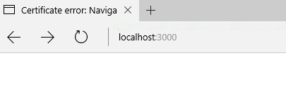
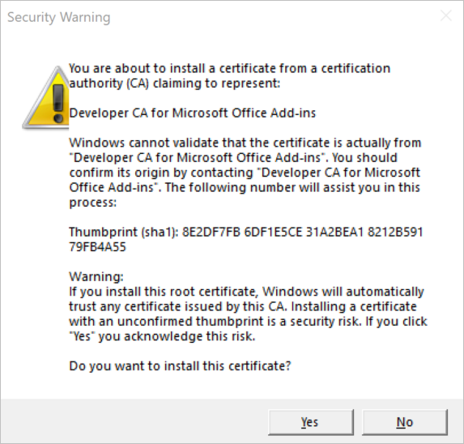
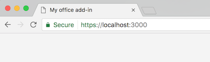
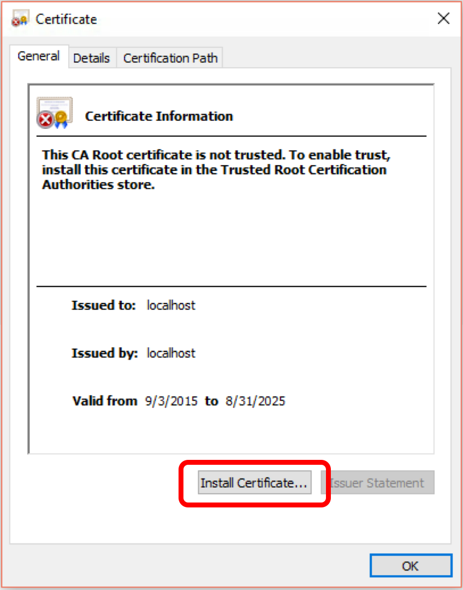
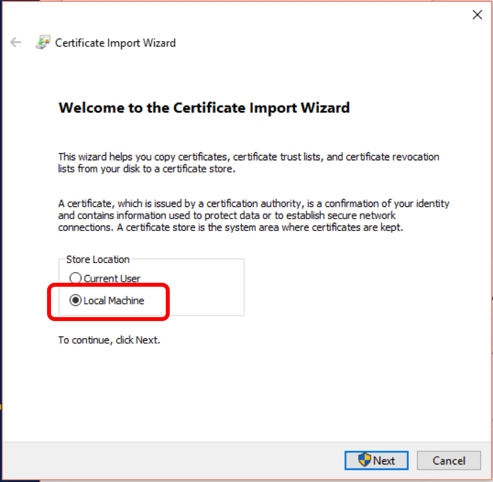

# Installing the self-signed certificate

Office Add-ins should use HTTPS (not HTTP) even when you are developing, because Office clients require add-ins and webpages to come from a trusted and secure location. If your add-in fails to load within an Office client, it may be because you haven't installed (trusted) the certificate that the Yeoman generator for Office Add-ins provides. 

When you browse to a site that has an untrusted certificate, the browser will display an error with the certificate, as shown in the following screenshots.

**Certificate error in the Chrome browser:**
  
  

**Certificate error in the Edge browser:**

  

This article describes two methods for installing (trusting) the certificate on your machine. Which method you use will depend upon how recent a version of the [Yeoman generator for Office Add-ins](https://github.com/OfficeDev/generator-office) you used to create your add-in project.

## Method #1: automatically install the certificate when prompted

If you used a sufficiently recent version of the [Yeoman generator for Office Add-ins](https://github.com/OfficeDev/generator-office) to create your add-in project, you'll be prompted to install a certificate when you start the local web server, if a valid certificate doesn't already exist on your machine.

Accept this prompt to install the certificate that the Yeoman generator provides, and the certificate will be added to the current user's **Trusted Root Certification Authorities** certificate store. You now have a valid self-signed certificate installed on your machine.

## Method #2: manually install the certificate
   
If you used an older version of the [Yeoman generator for Office Add-ins](https://github.com/OfficeDev/generator-office) to create your add-in project, you'll need to manually configure your machine to trust the self-signed certificate. The steps for this differ depending on your developer environment (macOS / Windows):

  * [macOS](#macOS)
  * [Windows](#windows)

### macOS

1. In **Finder**, open the **certs** folder in the root folder of your project.
2. Double-click the **ca.crt** file.
3. In the **Add Certificates** dialog box, choose **Add**. 
4. You'll be prompted for your credentials. Enter your credentials and choose **Modify Keychain**.
5. Open the **Keychain Access** utility.
6. Select the **Certificates** category, and double-click the **localhost-ca** certificate.
7. In the **Trust** section, set the following value
    
    **When using this certificate**: **Always Trust**
    
8. Close the dialog.
9. You'll be prompted for your credentials and will need to enter them to enable the certificate
   
At this point everything has been configured. Quit all browsers, then reopen and try to navigate to the local HTTPS site. The browser should report it as a valid certificate:

  

### [Windows](https://technet.microsoft.com/en-us/library/cc754841.aspx)

Take the following steps to setup the certificate authority cert for localhost:

1.	Go to {project root}\certs.
2.	Double-click ca.crt, and select **Install Certificate**.      
    

3.	Select **Local Machine** and select **Next** to continue.
    

4.	Select **Place all certificates in the following store** and then select **Browse**.
5.	Select **Trusted Root Certification Authorities** and then select **OK**.
6.	Select **Next** and then **Finish**.

You now have a self-signed certificate installed on your machine.

Copyright (c) 2017 Microsoft Corporation. All rights reserved.
